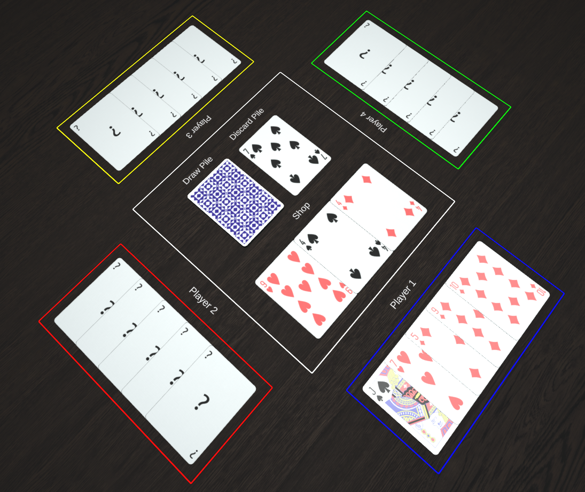
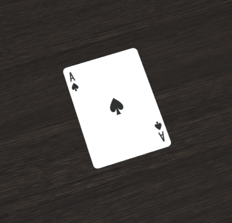
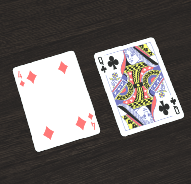
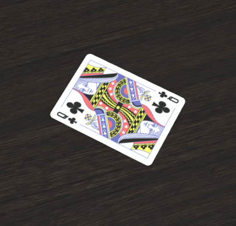
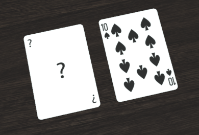
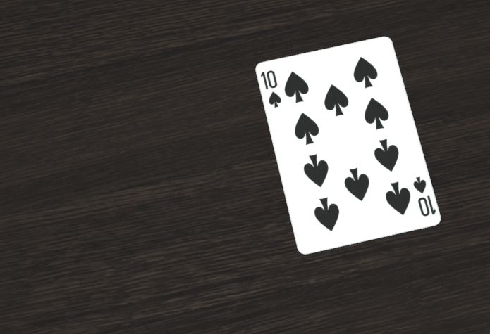
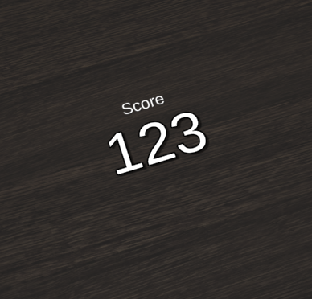
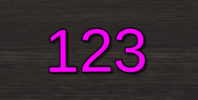

## Requirements
You will need:
* Follow the [Getting Started](/tutorials/01-getting-started.html) tutorial

## Background
The visuals of games are built from a bunch of 3D objects in a tree hierarchy. The root of that tree is an instance of your main [`Game`](https://team-bge.github.io/bge-core/classes/Game.html) class, which represents the table. Objects can contain other child objects, these children will be drawn when the parent object is drawn.

For example, let's see how this card game is structured:



The tree will look something like this:

```
Game
├─ Zone         (Table Center)
|  ├─ Deck      (Draw Pile)
|  |  ├─ Card   (Face down)
|  ├─ Deck      (Discard Pile)
|  |  ├─ Card   (7 of Spades)
|  ├─ Hand      (Shop)
|     ├─ Card   (9 of Hearts)
|     ├─ Card   (4 of Spades)
|     ├─ Card   (4 of Diamonds)
├─ Zone         (Player 1)
|  ├─ Hand      (Player Hand)
|     ├─ Card   (Jack of Spades)
|     ├─ Card   (8 of Hearts)
|     ├─ ...
├─ ...
```

So the `Game` object contains a bunch of [`Zone`](https://team-bge.github.io/bge-core/classes/Zone.html) objects, each `Zone` contains decks or hands of cards, which in turn contain individual [`Card`](https://team-bge.github.io/bge-core/classes/Card.html) objects. The tree of your game can be structured in whichever way makes sense to you.

## Display Decorator
We've got a cool game with the below code. `CardGame` has an `aceOfSpades` property, that will hold a single Ace of Spades card.

```typescript
import * as bge from "bge-core";

// ...

export class CardGame extends bge.Game<Player> {

    readonly aceOfSpades = PlayingCard.create(CardSuit.Spade, CardValue.Ace);

    // ...
}
```

Running it, we just get an empty table :'(


We need to add the card as a child of the game, like this:

```typescript
@bge.display()
readonly aceOfSpades = PlayingCard.create(CardSuit.Spade, CardValue.Ace);
```

Now we're talking :D



Adding [`@bge.display()`](https://team-bge.github.io/bge-core/functions/display.html) above a property will make whatever's stored in that property be visible, assuming the containing object is also visible. This is only valid on properties inside a class definition, meaning you can't use it on variables in a method body.

It even works fine on properties with a `get` method:

```typescript
@bge.display()
get aceOfSpades() {
    return PlayingCard.create(CardSuit.Spade, CardValue.Ace);
}
```

The `get` method will be evaluated each time the object is displayed to a player.

You can display anything extending [`bge.GameObject`](https://team-bge.github.io/bge-core/classes/GameObject.html), `string` values, `number` values, or arrays of those types.

Here's a string being displayed:

```typescript
@bge.display()
example: string = "Hello world!";
```


## Dynamic Children
The display decorator isn't always a good fit, like if you want to add or remove objects arbitrarily during the game.

Here's another way to add children, given a `parent` object:

```typescript
parent.children.add(child);
```

Later on, you can remove that child object from being displayed with:

```typescript
parent.children.remove(child);
```

This way of displaything things is a little more restrictive, because you can't use it with plain `string` or `number` values. You can, however, use it with a function that returns those types:

```typescript
parent.children.add(function () { return "Hello world!"; });
```

To go into a bit of detail, this is actually what the `bge.display()` decorator is doing behind the scenes. It's calling [`parent.children.add(...)`](https://team-bge.github.io/bge-core/classes/DisplayContainer.html#add) for each property that was decorated when the `parent` object is constructed.

You can manually trigger this behaviour like below, allowing you to add all the decorated properties from a different object to a given parent:

```typescript
parent.children.addProperties(otherObject);
```

## Display Options
You can provide an optional [`IDisplayOptions`](https://team-bge.github.io/bge-core/interfaces/IDisplayOptions.html) object to configure how children are displayed.

With the decorator you use it like this:

```typescript
@bge.display({
    // options here
})
```

You can also provide a function that will be called when displaying the object to dynamically generate the display options:

```typescript
@bge.display(function (this: ParentType, ctx: bge.RenderContext, value: PlayingCard) {
    return {
        // options here
    };
})
example: PlayingCard;
```

This lets you change the options based on the parent object's state (`this`), the [render context](https://team-bge.github.io/bge-core/classes/RenderContext.html) (`ctx`, which includes which player the object is being drawn for), and the current `value` of the displayed property.

When adding children dynamically, you can provide options like this:

```typescript
parent.children.add(child, {
    // options here
});
```

Later on, you can modify those options with this:

```typescript
const options = parent.children.getOptions(child);
// Modify options here
```

## Common Options
### position
You can change the [`position`](https://team-bge.github.io/bge-core/interfaces/IDisplayOptions.html#position) of a child object like this:

```typescript
@bge.display({ position: { x: -4 } })
card1 = PlayingCard.create(CardSuit.Diamond, CardValue.Four);

@bge.display({ position: { x: 4, y: -1 } })
card2 = PlayingCard.create(CardSuit.Club, CardValue.Queen);
```

Distances are measured in centimeters. The X axis increases to the right on the table, Y axis increases as you go forwards on the table, and Z increases
as you lift off the table surface.



Positions are relative to the parent object, so the axes I described above will be rotated according to the parent's rotation.

### rotation
Rotations can be set with [`rotation`](https://team-bge.github.io/bge-core/interfaces/IDisplayOptions.html#rotation):

```typescript
@bge.display({ rotation: bge.Rotation.z(45) })
card = PlayingCard.create(CardSuit.Club, CardValue.Queen);
```

Angles are given in degrees, and in this example we're rotating around the Z axis (yaw). You can also rotate around the other axes as a way to put objects on their backs or sides.



Rotation, like position, is relative to the parent object.

### hiddenFor / revealedFor
Some objects, like cards, can have their identities obscured when in a "hidden" state. The opposite of hidden is "revealed", meaning the identity is visible.

You can use the [`hiddenFor`](https://team-bge.github.io/bge-core/interfaces/IDisplayOptions.html#hiddenFor) and [`revealedFor`](https://team-bge.github.io/bge-core/interfaces/IDisplayOptions.html#revealedFor) display options to choose which players an object is hidden or revealed for:

```typescript
this.children.add(card1, {
    position: { x: -4 },
    revealedFor: [ this.players[0] ]
});

this.children.add(card2, {
    position: { x: 4 },
    hiddenFor: [ this.players[0] ]
});
```

The first card is revealed only to Player 1, so all other players will see a generic valueless card in its place. The second card is only hidden to Player 1, so all other players can see it fine.



These options will trickle down to any child objects, so for example setting them on a `Hand` of cards will cause each contained `Card` to be hidden for the same set of players.

Since you need to actually provide [`Player`](https://team-bge.github.io/bge-core/classes/Player.html) instances with these options, you'll often use them with the overload of `@bge.display(...)` that accepts a function:

```typescript
export class Player extends bge.Player {
    
    @bge.display(function (this: Player) { return {
        revealedFor: [this]
    } })
    readonly hand = new bge.Hand(PlayingCard, HAND_WIDTH_CM);
}
```

Remember to manually specify the type of the `this` parameter here to make TypeScript happy. It needs to match the type of the containing class as in this example.

### visibleFor / invisibleFor
Similarly, you can make objects selectively invisible to a set of players with [`visibleFor`](https://team-bge.github.io/bge-core/interfaces/IDisplayOptions.html#visibleFor) and [`invisibleFor`](https://team-bge.github.io/bge-core/interfaces/IDisplayOptions.html#invisibleFor):

```typescript
this.children.add(card1, {
    position: { x: -4 },
    visibleFor: [ this.players[0] ]
});

this.children.add(card2, {
    position: { x: 4 },
    invisibleFor: [ this.players[0] ]
});
```

From Player 1's perspective, only `card1` can be seen. All other players see only `card2`.



### label
When displaying numbers, the [`label`](https://team-bge.github.io/bge-core/interfaces/IDisplayOptions.html#label) option is often useful:

```typescript
@bge.display({ label: "Score" })
score: number = 123;
```



### fontColor
For `number` or `string` values, you can change the color with [`fontColor`](https://team-bge.github.io/bge-core/interfaces/IDisplayOptions.html#fontColor):

```typescript
@bge.display({ fontColor: bge.Color.parse("#ff00ff") })
score: number = 123;
```



### fontScale
Here's another one specific to text, [`fontScale`](https://team-bge.github.io/bge-core/interfaces/IDisplayOptions.html#fontScale):

```typescript
@bge.display({ fontScale: 0.5, position: { y: 3 } })
smol: string = "im smol";

@bge.display({ fontScale: 2, position: { y: -2 } })
big: string = "I'M BIG";
```

By default text uses `fontScale: 1`, so the value you give is relative to that size.


